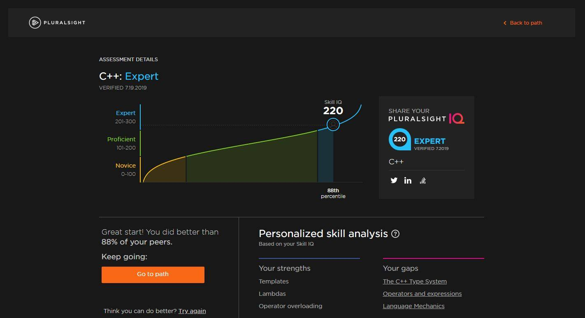
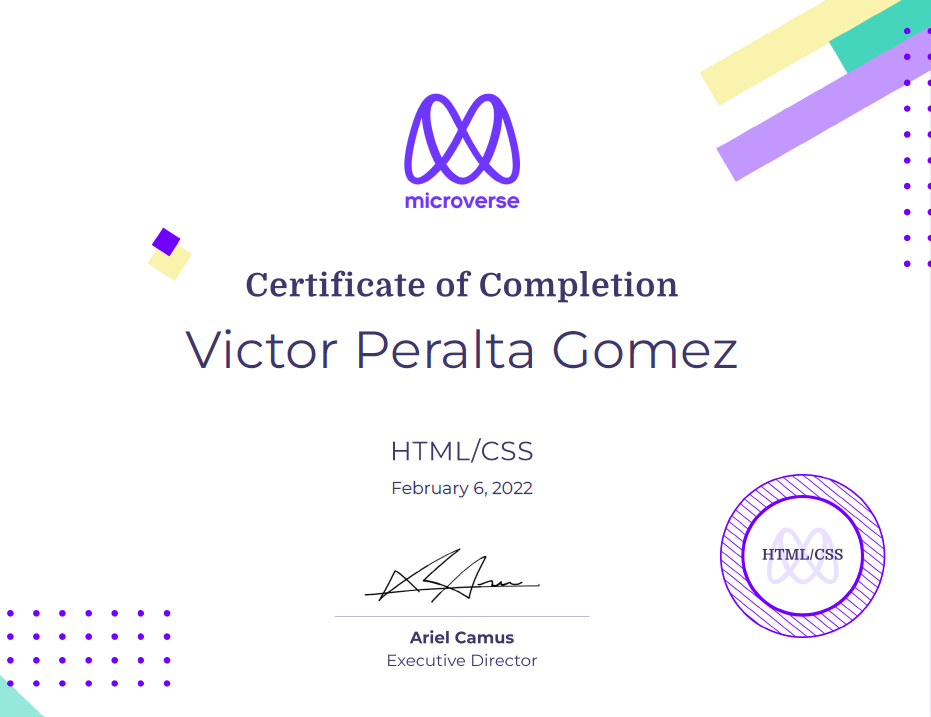

### Hello, I'm Victor 👋

I am a C++ developer currently learning Web development at [Microverse](https://github.com/microverseinc).  
I studied electronics, but I have always loved to program.  
I have developed applications mainly for Windows using C++, C#, and Visual Basic, but I am always learning new tools.

Just finished HTML / CSS Module

- 🔭 I’m currently working on preparing my portfolio, please come back later to see it.
- 🌱 I’m currently learning Javascript and its tools
- 👯 I’m looking to collaborate on any project
- 🤔 I’m looking for help with preparing for job interviews
- 💬 Ask me about anything, I might not be able to help, but you can ask me
- 📫 How to reach me: victor.peralta.gomez@gmail.com
- 😄 Pronouns: He
- ⚡ Fun fact: I love to play chess even when it gives more headaches than joys

## Github Stats 📈

 

  <a href="https://github.com/VicPeralta">
  
  

